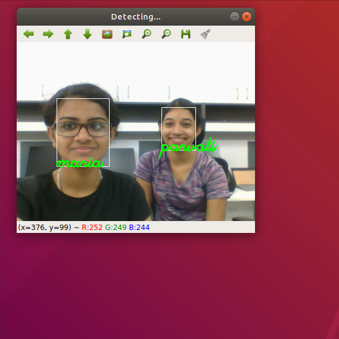

# Facenet_FR
## Face recognition through Facenet Model in PyTorch
Face recognition is the ability to look at the digital image of a human and recognize the person just by looking at the face.

FaceNet was introduced in 2015 by Google researchers; it has been a backbone of many open source Face Recognition networks like OpenFace. It is a one shot learning method that uses a Deep Convolutional Network to directly optimize the embeddings. The network consists of a batch input layer and a deep CNN followed by L2 normalization, which results in the face embedding. This is followed by the triplet loss during training.

It returns a 512 dimensional vector embedding for each face

## Description

A facial recognition system is a technology capable of identifying or verifying a person from a digital image or a video frame from a video source. There are multiples methods in which facial recognition systems work, but in general, they work by comparing selected facial features from given image with faces within a database

Here,we have used mtcnn to detect and align the faces from images.

We have used Haarcascade Classifier,to detect faces in a webcam,since haarcascade is faster than mtcnn.Hence,it is required that the faces be clearly visible while testing.

## Method Implemented

The model runs on CPU. It is coded in Jupyter notebook.

So let's take a brief look on each step
Step 1: Hit the following commands in CMD/Terminal if you don't have already them installed:
Install PyTorch (without CUDA) using

conda install pytorch-cpu -c pytorch

pip3 install torchvision
Install OpenCV

pip install opencv-python

### Step 2: Face Recognition from Image

Dataset used: 'datas/pic' it has images of over 10 celebrities. Run 'Face_Recognition_Images.ipynb'

First get the embeddings. Then, specify the image location and run the code.

Result is as follows:

#### Step 3: Face Recognition from webcam

Dataset used: 'data/pic' (This file is not included here) 

Run 'Face_Recognition_Webcam.ipynb'

First get the embeddings. Then open Webcam and it recognises your face.

Result is as follows:

#### Step 4: Accuracy:
Run "Accuracy_check.ipynb"
Dataset used: 'data/test_public' testing set has around 10 images  each  for 10 celebreties. So a total of 95 images.
First get the embeddings  of the faces by specifying the training dataset location(datas/pic);

###### "dataset = datasets.ImageFolder('datas/pic')"

Specify the location of testing dataset(data/test_images) in the get_files function.

###### "files = glob.glob("data/test_public/%s/*" %nam) "

Result is as follows:Got an accuracy of 98.9%,with a threshold of 0.73

For related people(family) ,got an accuracy of 95.45,with a threshold of 0.81

## References
timesler's implementation of facenet model in pytorch:https://github.com/timesler/facenet-pytorch

Deep Face Recognition: A Survey  https://arxiv.org/pdf/1804.06655.pdf 

Real time face recognition using opencv and Deep learning,by Atul Kumar https://www.youtube.com/watch?v=-HweZMO5sFY 

